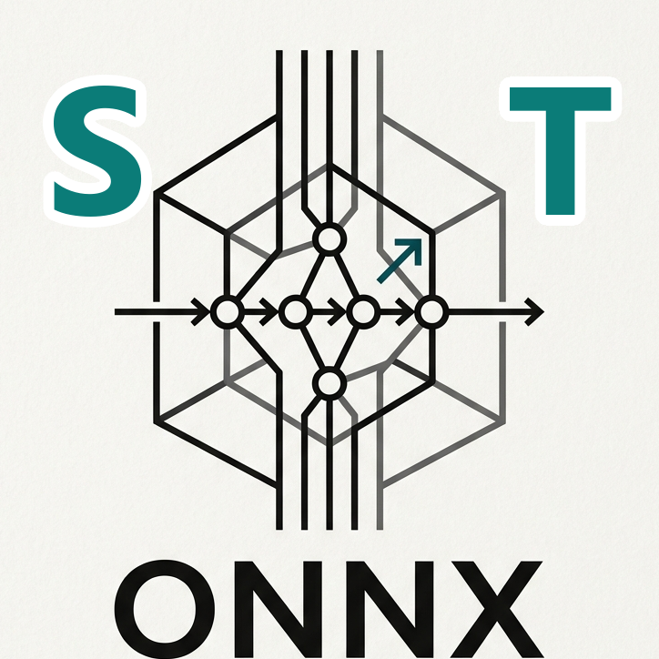



  
  <h1><a href="https://run-onnx.github.io">Synshape Tensor Synthesizer</a></h1>
  
<strong>A Bionic, Zero-Backend ONNX Studio for Extreme Edge-Performance.</strong>

  
<i>Created by <a href="https://micha1a.github.io">Michael Barlozewski</a></i>

---

## ⚡ Overview

The **Synshape Tensor Synthesizer** is a hyper-optimized, locally executing studio designed to construct, visualize, and export ONNX (Open Neural Network Exchange) tensor structures with zero latency. 

Built on a strict **"Bare-Metal O(1)"** philosophy, it completely bypasses traditional bloated backend architectures, running entirely in your browser via highly optimized **WebAssembly (WASM)** cores written in **Zig** and **Rust**.

## 🚀 Why Synshape? (The Unfair Advantage)

While tools like *Google's Teachable Machine* or standard Python Jupyter environments rely on heavy cloud infrastructure, hidden API calls, or bloated runtime environments, Synshape takes a radically different approach:

- **100% Zero-Backend & Privacy First:** Absolutely no data is sent to external servers. Your tensors, models, and intellectual property never leave your machine.
- **Dual WASM Architecture:** 
  - **The Bionic Core (Zig):** Handles raw ideomotor mathematics and haptic inputs directly via SharedArrayBuffer, bypassing JavaScript's garbage collector for true O(1) real-time performance.
  - **The Vault (Rust):** A highly obfuscated, secure environment for assembling and compiling the final .onnx models.
- **Bionic Haptic Coupling:** We don't just use UI sliders. Synshape maps the physical friction and momentum of your touchpad directly into the tensor logic, creating a tactile, biological connection to the AI math.
- **Codex Metadata Injection:** Embed your proprietary knowledge, JSON structures, or custom SVG data directly into the exported ONNX model's metadata—acting as a portable, intelligent payload.
- **Instant Edge-Deployment:** The exported models are lightweight, perfectly structured, and ready to be deployed on any edge device globally without further translation.

## 🛠️ Technical Architecture

- **Frontend:** React 19, Vite 8, Tailwind CSS v4, Lucide Icons.
- **Bionic Engine:** Zig (compiled to wasm32-freestanding).
- **Export Vault:** Rust (compiled via wasm-pack).
- **Security:** Advanced DOM-Level 0 Event Capture (anti-theft), native context-menu blocking, CSS touch-callout neutralization.

## 🛡️ License & Copyright

**PROPRIETARY & CONFIDENTIAL**  
&copy; 2026 Michael Barlozewski. All rights reserved.

Unauthorized copying, modification, decompilation, or distribution of this software or its compiled WASM modules via any medium is strictly prohibited. The system includes advanced anti-disassembler opaque guards and control-flow flattening.
